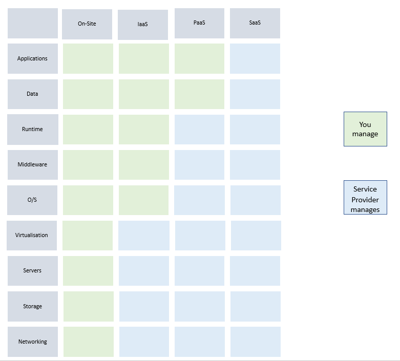
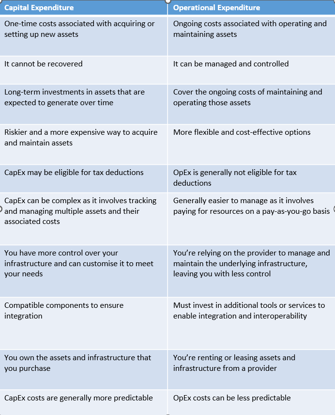

# AWS and Cloud Computing

### what is cloud computing?

Cloud computing is the on-demand access to computer services over the internet.

----

### A quick history of cloud computing

(Info via ibm.com)

In the 1950s, when large-scale mainframes were made available to schools and corporations, the hardware infrastructure was installed in a 'server room' and multiple users were able to access the mainframe by using 'dumb terminals'. These were stations with the sole function of facilitating access to the mainframes.

This was expensive and organisations weren't able to afford a mainframe per user so multiple users shared access to the same data storage layer and CPU (Central Processing Unit) power from any station.

In the 1970s, virtualisation allowed computers to have multiple virtual machines on a single physical node.

As the internet became more accessible, the next logical step was to take virtualisation online.  The cost of hardware had come down but now one server wasn't enough to provide the necessary resources.

Thus the cloud was born.

By installing and configuring a piece of software called a `hypervisor`across multiple physical nodes, a system would present the environment's entire resources as though they were in a single physical node.

As technologies and hypervisors improved, companies made the cloud's benefits available to those who didn't have lots of physical servers (and therefore able to create their own cloud computing infrastructure). These users could order `cloud servers` by ordering what they needed from the larger pool of resources.  As servers were already online, the process of 'powering up' a new instance or server was almost instantaneous and little overhead is involved for the owner of the cloud environment as when a new instance is ordered or cancelled the cloud's software handles this.  This makes managing the environment much easier.

----

### What are the benefits of cloud computing?

1. Flexibility - users can use what they need and when, customising services to fit.

2. Efficiency - users can get applications to market quickly.

3. Cost - users can save costs especially as it is a pay-as-you-use system.

4. Security - using encryption makes things more secure.

5. Mobility - allows use over phones as well as laptops and computers so can be updated instantly.

6. Quality control - everyone has access to the same data which is stored in the same place so there is more consistency.

7. Sustainability - the cloud is more environmentally friendly.

8. Competitve edge - gives a competitive advantage as the most innovative tech available.

----

### What are the main benefits of cloud computing for businesses?

The main benefits of cloud computing for businesses are similar to those listed above but in addition:

1. Automatic software updates - means that this is something you don't have to worry about.

2. Loss prevention - if you lose things on your computer, the information is safe on the cloud.

3. Disaster recovery - Cloud based services provide quick data recovery.

4. Increased collaboration - Cloud computing makes working together easier.

----

### What is AWS?

AWS (Amazon Web Services) is the world's most comprehensive and popular cloud.

----

### A quick history of AWS

In 2003, Amazon had an advantage over their competitors in their ability to manage and scale their infrastructure reliably and efficiently. They began an idea of an 'Operating system of the Internet' where different hardware resources would be isolated (i.e. computing, storage, memory etc.) as components to this operating system and served up as managed services. This allowed businesses to focus on their business cases rather than manage hardware and physical infrastructure.

Amazon had already had to build reliable and cost-effective data centers for themselves out of necessity and broadened this to allow any organisation to do this using their infrastructure platform.

----

### Who are the other main cloud service providers?

1. Microsoft Azure

2. Google Cloud Platform

3. IBM

4. Alibaba Cloud

----

### What is IaaS, PaaS and SaaS?

- Infrastructure-as-a-Service

- Platform-as-a-Service

- Software-as-a-Service

These are different ways to use the cloud.

The image below illustrates what kind of services are provided with each model:

----

### What is the difference between public cloud, hybrid cloud and private cloud?

- Public cloud: Cloud resources are owned and managed by a third party cloud service provider.

- Hybrid cloud: Combines on-premise (or private cloud) with public cloud which enables data and apps to move between the two environments.

- Private cloud: Cloud resources used exclusively by one organisation.

----

### What types of industry/ businesses use the different types of cloud?

#### Public Cloud
Businesses that use:
- collaboration and project management
- data archiving
- sales
- development and testing environments

#### Hybrid Cloud
Businesses that use:
- untested workloads
- cloudbursting
- availability and disaster recovery
- regulatory requirements
- data center expansion

#### Private Cloud
Businesses that:
- use speciality hardware
- need to meet government or regulatory requirements
- need to avoid network latency

----

### What is Operating Expenditure (OpEx) and what is Captial Expenditure (CapEx)?

Operating Expenditures are a company's day-to-day expenses. For example, salaries, rent, utilities...

Capital Expenditures are a company's major, long-term expenses. For example, buildings, equipment, vehicles...

Capital Expenditures tend to be for purchases that will add value to the company for more than a year, or are intangible, like patents.

----

### Which is preferrable and how does the cloud allow businesses to transfer to spending more on the preferred one?

Below is a table to illustrate the differences between CapEx and OpEx (taken from genesesolution.com):

So they both have advantages and disadvantages.

----

### Case studies on companies that have transferred to the Cloud and what that has allowed them to do:

**Illumina** reduced carbon emissions by 89% and lowered data storage costs using AWS.

**BMW Group** uses Amazon Sagemaker geospatial capabilities to deliver sustainable mobility solutions around the globe.

**Botprise** reduces time to remediation by 86% on average using automation and AWS Security Hub.