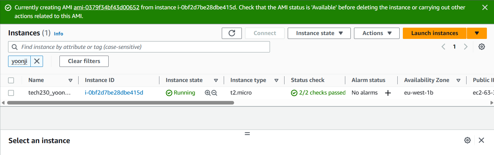
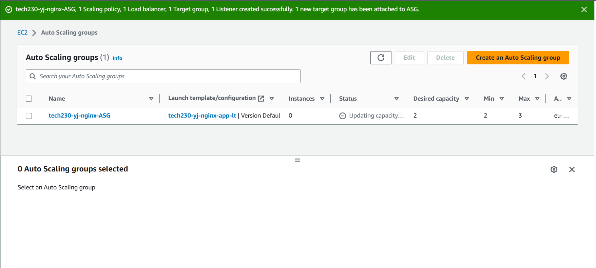
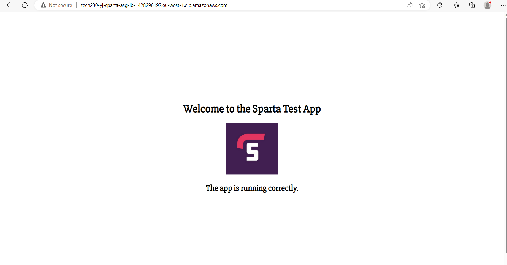

# Autoscaling

Scaling up: more resources (storage, CPU power, RAM) for the VMs

Scaling out: requires more VMs

The AUTOSCALING GROUP will provide instances and create more when required.  They need to provide more when needed and less when necessary.

The LOAD BALANCER receives traffic from the oustide and directs the traffic through the cloud to different instances.

----

In order for the autoscaling group to be able to manage all the instances, first there is some ground work...

From EC2 instance, create an AMI (snapshot of all the data in the VM), and from the AMI create a Launch template.

In a Launch template you can save the configuration for the VM and specify the AMI you want to use.

----

Once you have a `Launch template` you can specify the one you want for your Autoscaling group.  When it meets the criteria from the autoscaling policy

In the autoscaling policy, you can set a threshold.  When will it create more virtual machines? You can set a minimum number of instances, a desired number of instances, a maximum number of instances and what will be the trigger to create more instances.  (In this example, min = 2, des = 2, max = 3, trigger = CPU 50%)

### To create an autoscaling group

1. Create an instance

Go to `instances` and `launch instance`

Put in a name using the naming convention (e.g. tech230_yoonji_nginx)

Use an 18.04 Ubuntu image.  Search under community AMIs. (Remember, not pro or micro, as long as they run on t2:micro, should be ok)

Enter the keypair: `tech230`

Use an existing security group by searching your name.  One that allows HTTP and SSH.

In User data enter commands to install Nginx:

`#!/bin/bash`

`sudo apt-get update -y`

`sudo apt-get upgrade -y`

`sudo apt-get install nginx -y`

`sudo systemctl restart nginx`

`sudo systemctl enable nginx`

Check over details, then if happy, `Launch instance`.

Go to ip address on instance page and check to see if it works (although it may take a while to load.) Take away the 's' from https.

----

2. Create an AMI from the running instance

Go to instance summary page then `Actions`, `Image and templates`, and `Create image`.

Fill in name, using the naming convention. (E.g tech230_yoonji_nginx_ami) and description (E.g 18.04 Nginx AMI)

Leave others on default settings.

`Create image`

Wait for it to be `available`

Go to the AMI and if the name is blank, fill this in.

----

3. Create Launch template from AMI

Go to `Launch templates` on left hand side.

Then `Create launch template`

Fill in the name `tech230_yoonji_nginx_lt` 'lt' for the launch template

Specify your AMI

Instance type `t2:micro`

Put in keypair and Network settings...

Put in user data.

`#!/bin/bash`
`cd /home/ubuntu/repo`

`npm install`

`pm2 start app.js`

----

Create an instance using this template.

`Create launch template`

----

If you have your launch template, should be able to terminate your instance.

----

Go to `Auto scaling groups` in EC2 dashboard

Click `Create Auto Scaling group`

----

Step 1.

Enter name `tech230_yoonji_nginx_ASG` 'ASG'for Auto Scaling Group

Select `Launch template`

`Next`

----

Step 2.

Choose instance launch options.

Select the three `DevOpsStudent default` options for the availability zones (in Ireland)

----

Step 3.

Configure Advanced Options.

Load balancing:

`Attach to a new load balancer`

Keep on `Application Load Balancer`

Put in `Load balancer name` using naming convention and using hypens not underscore. Remember there is a limited number of characters you can use.

For `Load balancer scheme` click `Internet-facing`.

For `Listeners and routing` `Create a new target group` put TG at the end so you know it's for the target group.  Remember to use the naming convention and use hypens with correct number of characters.

Under `Health checks` click box for `Turn on Elastic Load Balancing health checks`

Then `next`

----

Step 4.

Configure group size and scaling policies

Enter `Desired capacity`, `Minimum capacity` and `Maximum capacity`

For this demo: 2, 2, 3.

For `Scaling policies` click `Target tracking scaling policy`

`Target value` is in percentages here.

Then `next`

----

Step 5.

Add notifications

Can skip this for now.

----

Step 6.

Add tags

`Add tag`

`Key` should be `Name`

And the `Value` can be `tech230-yoonji-nginx-HA-SC` for High Availability, SCalability.

Then `next`

----

Step 7.

Review

----

`Create Auto Scaling Group`

----

Go to `Load balancers` and you can copy the DNS name (up to .com) then put this into a web browser to check.  Should go to the Sparta webpage:

----

When you delete the `Auto Scaling Group` it will ask you to confirm.

Same with deleting `Load balancers`

The instances will be terminated too.

----
