# AWS EC2

### Table of contents:

[1. Creating an Instance](https://github.com/yjk16/aws/blob/main/aws_instance.md#1-creating-an-instance)

[2. To add a Bash script and provision Nginx installation](https://github.com/yjk16/aws/blob/main/aws_instance.md#2-to-add-a-bash-script-and-provision-nginx-installation)

[3. To make a MongoDB AMI](https://github.com/yjk16/aws/blob/main/aws_instance.md#3-to-make-a-mongodb-ami)

[4. Creating an AMI for the MongoDB installation](https://github.com/yjk16/aws/blob/main/aws_instance.md#4-creating-an-ami-for-the-mongodb-installation)

[5. Deploying the Sparta app on EC2](https://github.com/yjk16/aws/blob/main/aws_instance.md#5-deploying-the-sparta-app-on-ec2)

[6. Making an AMI of the app](https://github.com/yjk16/aws/blob/main/aws_instance.md#6-making-an-ami-of-the-app)

[7. Automating reverse proxy](https://github.com/yjk16/aws/blob/main/aws_instance.md#7-automating-reverse-proxy)

### 1. Creating an Instance

Log into the AWS console and make sure you are set to the Ireland (eu-west-1) region setting.

----

Virtual machines here are called EC2 = elastic cloud 2 = instances

Go to EC2 dashboard.

It should look like this:

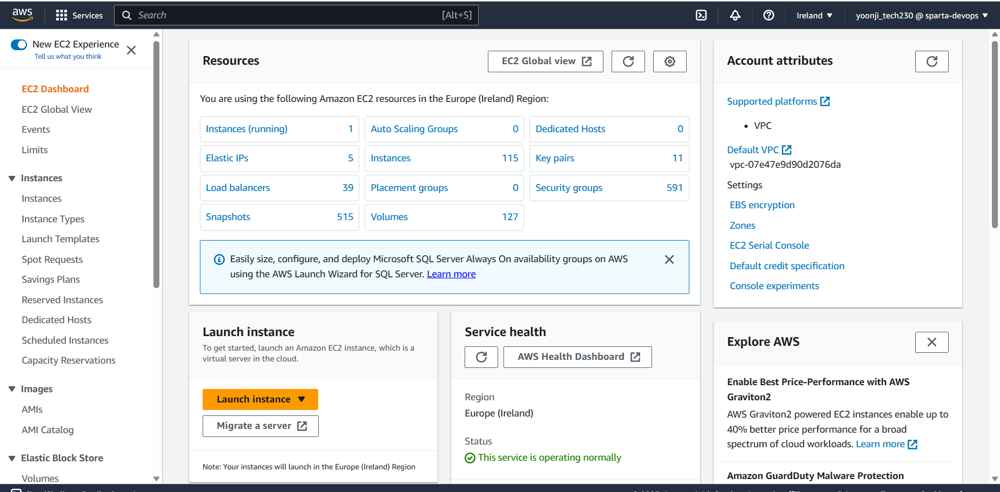

----

Click on the orange `Launch instance` button and launch a new instance.

Name your instance by using the naming convention:

group - name - type of resource

In this example:

`tech230_yoonji_first_ec2`

To choose the operating system, under `Application and OS Images`:

Click `Ubuntu`

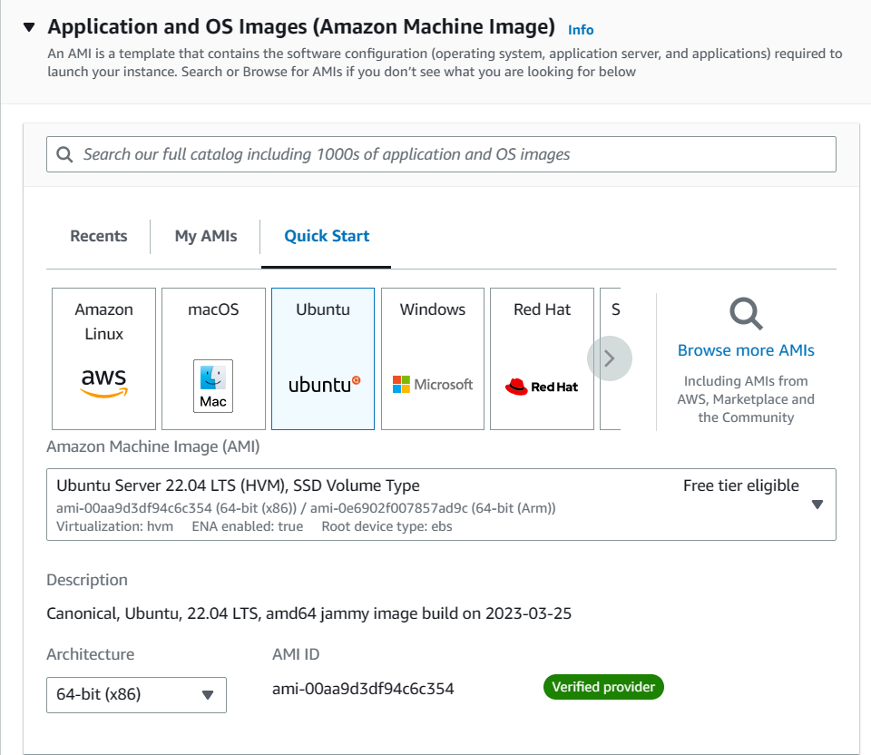

----

For the Instance type (hardware):

click `t2.micro`
It should say `Family:t2` under this.

For the Key pair (login):
tech230

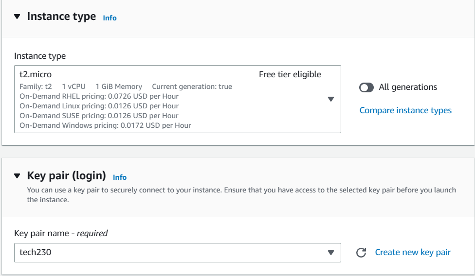

----

For the Network settings:
press `edit`

Under `Firewall`:

`Create security group`

Under `Security group name` create a name remembering to use the naming convention:

For example:
`tech230_yoonji_first_sg`

Add a description = `My first security group`

----

Under `Inbound security group rules`

You can `Add security group rule`

Under `Type` put `HTTP`

And under `Source` put `0.0.0.0/0` which will allow anyone anywhere to access this.

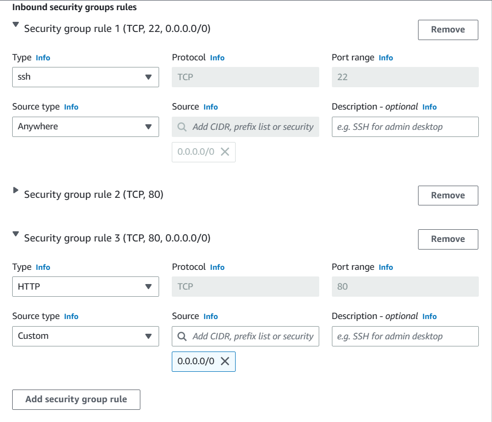

----

`Launch instance`

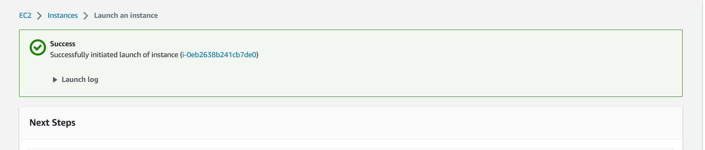

Click `Instances` to check it's running...

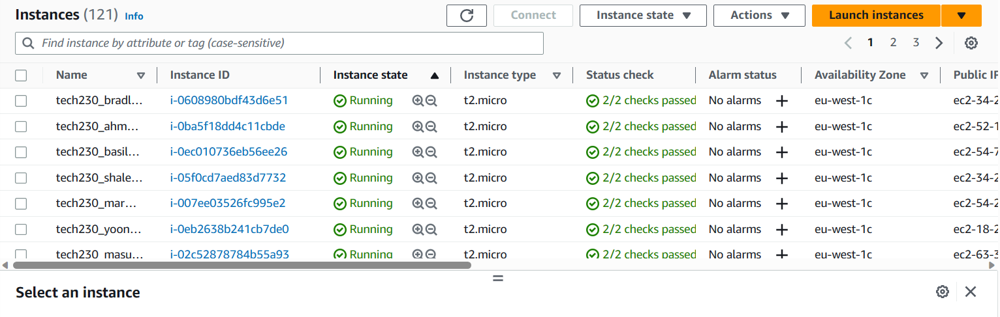

Click on the instance that you want (under your name)

Then the `connect` button
Then `SSH client`

----

Open a Bash terminal:

And `cd .ssh` from home.

Then:

`chmod 400 tech230.pem`

----

Grab the code under `Example` back on the AWS webpage:

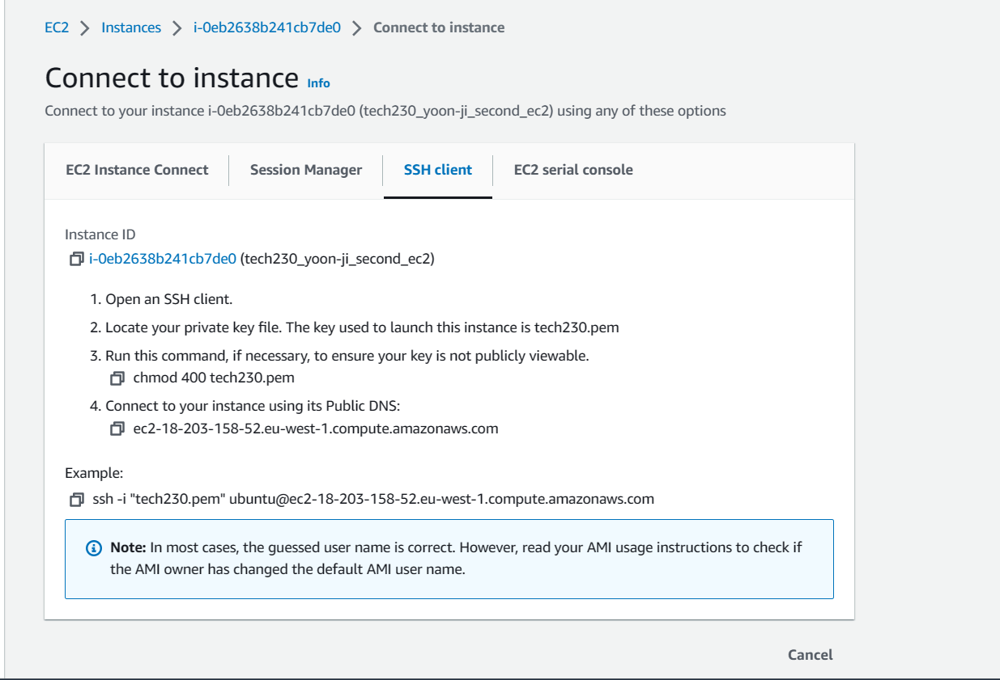

----

And paste this into your bash terminal.

press 'yes' when it asks about the fingerprint...

And you are now in the VM.

----

`sudo apt update -y`

`sudo apt upgrade -y`

`sudo apt install nginx -y`

`sudo systemctl start nginx`

`sudo systemctl enable nginx`

`sudo systemctl status nginx`

----

Go back to webpage:

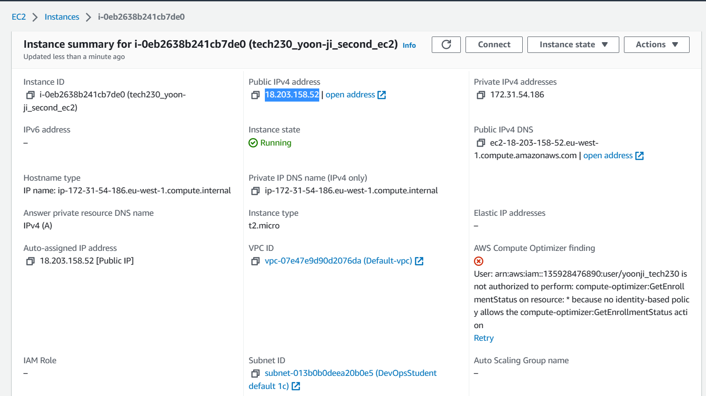

Copy the ip address and paste it into a web browser to check:

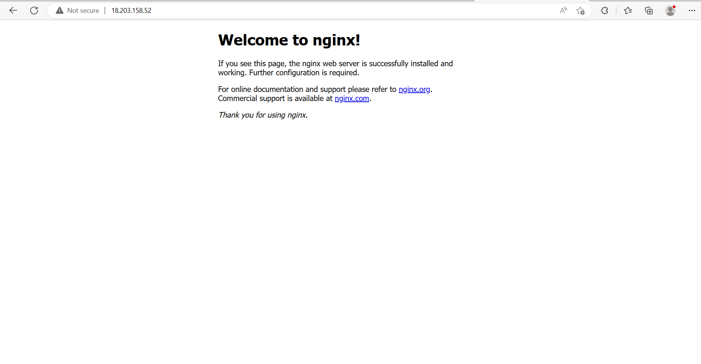

If you see the above, then you've been successful!

Don't forget to terminate your instance when you're done:

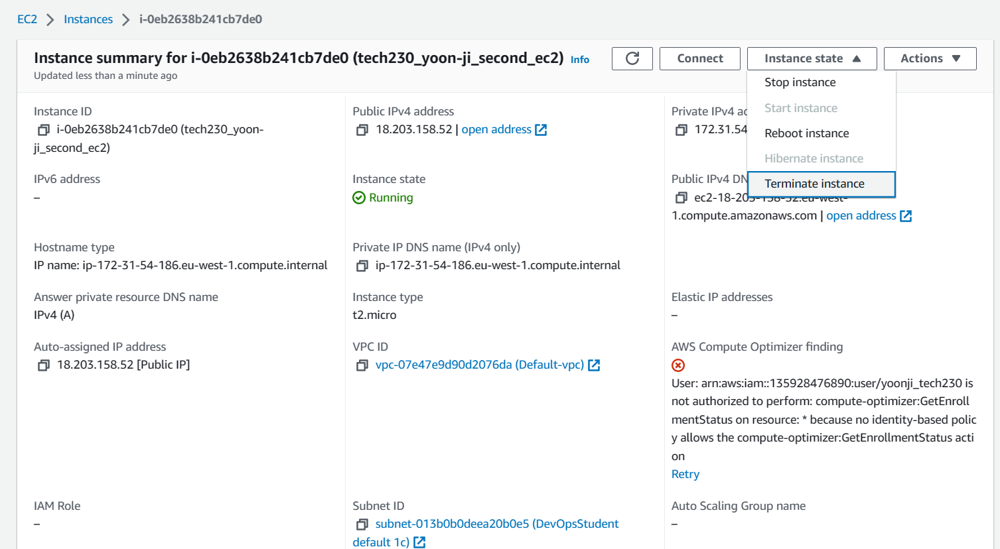

----

### 2. To add a Bash script and provision Nginx installation

Go to `Advanced details` when launching an instance.

Under `User data` add your script:

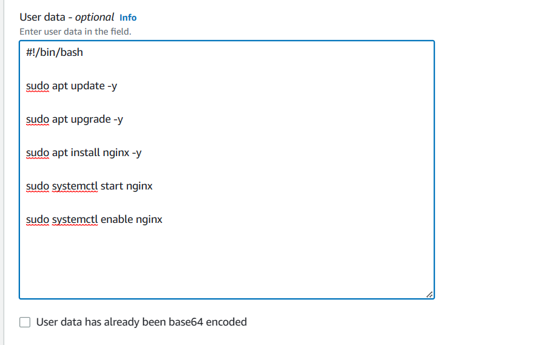

Then `launch instance`

----

Once `2/2 checks passed` under `Status check`, click `Instance ID` and then `Connect`

----

Copy the command under `Example` then open a Bash terminal:

If in .ssh directory, paste the code.  Enter 'yes' when asked about the fingerprint.

This should take you into the instance:

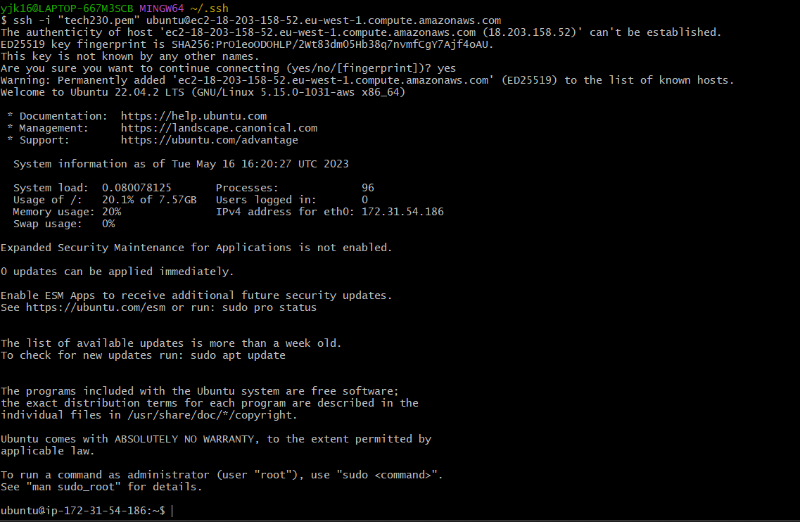

----

`sudo systemctl status nginx` if you want to check the status of nginx.

If that's all good, you can copy the public IP address under your instance ID and paste it into a new tab.

----

Should connect you to Nginx:

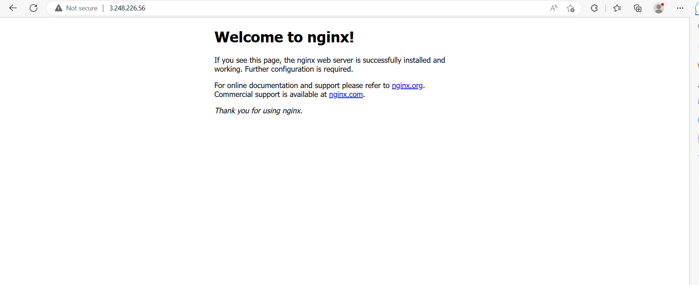

 ----

AMI = Amazon Machine Imagine

 is a snapshot. A template.  Can launch a copy of the instance.

 ----

(The following creates a template of an instance, but not an AMI...)

Tick the box of your instance, then under `Actions`, click `Image and Templates` and from there `Create template from instance`

This will take you to the `Create launch template` page.

Enter a name using the naming convention and a description.

Then `Create launch template`

(This will save settings but not data.)

----

NOTE: A launch template saves settings but not the image of a disk.  It will save security groups and the type, etc... To save the data and make an image you need to make an AMI to store the data.

To do this...

Whilst in the instance with all the details you want saved, go to your instance and under `Actions` go to `Image and templates` then `Create image`.

Enter name, using the naming convention and a description.  Then `Create image`.  This will create an AMI.

 ----

 Under `Launch instance`, `launch instance from template` if you want to launch an instance template.

 ----
 To launch a previously created AMI, go to `Launch instance` and under `Application and OS images` click `My AMIs` and search for the one you are looking for.

----

 If you have two provisions, instead of using user data, can use AMIs.

 ----

### 3. To make a MongoDB AMI

First make a MongoDB instance.

Connect the ssh key from AWS in your .ssh directory in Bash.

You are now in the MongoDB instance.

To check manually first, enter the following commands:

`sudo apt update -y`

`sudo apt upgrade -y`

`sudo apt-key adv --keyserver hkp://keyserver.ubuntu.com:80 --recv D68FA50FEA312927`

`sudo apt install mongodb -y`

`sudo systemctl start mongodb`

----

### 4. Creating an AMI for the MongoDB installation

Enter name, using the naming convention and a description.  Then `Create image`.  This will 
`Create launch template`

And under `User data`

Add the above commands after stating the language of bash:

`#!/bin/bash`

`sudo apt-get update -y`

`sudo apt-get upgrade -y`

`sudo apt-key adv --keyserver hkp://keyserver.ubuntu.com:80 --recv D68FA50FEA312927`

`sudo apt install mongodb -y`

`sudo systemctl start mongodb`

`sudo systemctl enable mongodb`

----

To check, terminate the instance and see if you can launch the template of the Mongodb instance.

Once you've launched the template and it passes the two checks, ssh into the terminal.  Mongodb should be running.

You can check this using:

`sudo systemctl status mongodb`

----

### 5. Deploying the Sparta app on EC2

Create an instance or launch an AMI with all the correct settings, including security groups.

Make sure to add in the mongodb AMI `add rule` of type `Custom` with port range `27017` which is the port that mongodb operates on and put `source` as `0.0.0.0/0`. `Save rules`. `SSH` type should already be there (if you've done this before).

Copy the private IP address from your mongodb instance.

----

In a Bash terminal cd into the directory where your app folder is:

then paste

`scp -i "~/.ssh/tech230.pem" -r app ubuntu@ec2-<ip address of your instance>.eu-west-1.compute.amazonaws.com:/home/ubuntu` to copy over the app folder into the instance.

In this case:

`scp -i "~/.ssh/tech230.pem" -r app ubuntu@ec2-3-249-150-209.eu-west-1.compute.amazonaws.com:/home/ubuntu`

Then connect via ssh in Bash (make sure you are in the directory with `app` in it):

`ssh -i "~/.ssh/tech230.pem" ubuntu@ec2-54-216-148-79.eu-west-1.compute.amazonaws.com`

You should be in the instance.

`ls` to check that `app` is there.

----

cd into app:
`node --version` to check which version of node is there.  It should be version 12.

** Update, upgrade the system and install Nginx (if not using a previously made AMI):

`sudo apt-get update -y`

`sudo apt-get upgrade -y`

`sudo apt-get install nginx -y`

`sudo systemctl start nginx`

----

Add the dependencies (same as when using Vagrant):

`curl -sL https://deb.nodesource.com/setup_12.x | sudo -E bash -`

`sudo apt-get install nodejs -y`

`sudo npm install pm2 -g` if this doesn't work:

`sudo apt install npm`

`cd app`

then:

`npm install`

----

Then (only if the above doesn't work):

`pm2 start app.js` if this doesn't work...

`npm i -g pm2` or `sudo npm i -g pm2`

then:

`pm2 start app.js`

Hopefully you will see this:

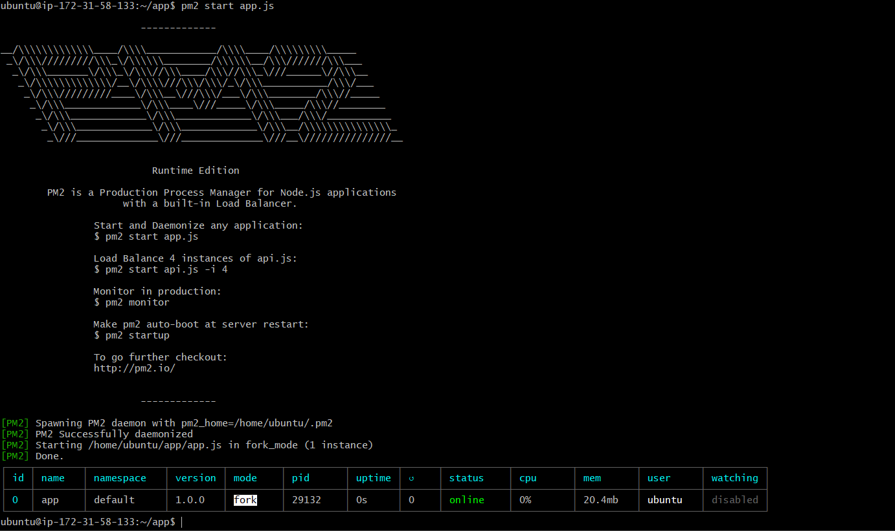

**

----

`export DB_HOST=mongodb://192.168.10.150:27017/posts`

but change the ip address to the private ip address you copied from your mongodb instance.

`printenv DB_HOST` to check.

----

You still need to change the security group to add the port `3000` so go to your instance page and under `Security` click on `Security groups` and `Edit inbound rules`.

`Add rule`

Change the port range to `3000` and make sure anyone can reach it by putting the `Source` as `0.0.0.0/0`

Also change the `Source` for the `SSH` to `My IP`

`Save rules`

----

`exit` on Bash

Go to your instance and connect again by pasting your ssh key into Bash.

You should be able to connect to the web browser through your instance.  If it is `https` get rid of the `s` and add `:3000`

If database is cleared and seeded:

`pm2 start app.js --update-env`

Go back to your app instance and go to public IP address.

Tap in `:3000` after the IP and you should be connected to the Sparta App page.

Add `/posts` after that to reach the posts page.

----

### 6. Making an AMI of the app

NOTE: A launch template saves settings but not the image of a disk.  It will save security groups and the type, etc... To save the data and make an image you need to make an AMI to store the data.

Whilst in the instance with all the details you want saved, go to your instance and under `Actions` go to `Image and templates` then `Create image`.

Enter name, using the naming convention and a description.  Then `Create image`.  This will create an AMI.

----

If you already have two AMI's (one for app and one for db), you should be able to use these. Go to My AMIs and click on relevant AMIs to start them and connect.

----

Otherwise, go to EC2 dashboard and launch an instance

Fill out info including name, user data and check security group.

The db user data should have:

`#!/bin/bash`

`sudo apt update -y`

`sudo apt upgrade -y`

`sudo apt-key adv --keyserver hkp://keyserver.ubuntu.com:80 --recv D68FA50FEA312927`

`sudo apt install mongodb -y`

`sudo systemctl start mongodb`

Launch the instance

----

Connect to bash via ssh

`ssh -i "tech230.pem" ubuntu@ec2-54-246-247-106.eu-west-1.compute.amazonaws.com`

making sure to change the ip address.

Should now be in the instance.

Can go through checks manually...

Or check by entering:

`sudo systemctl status mongodb`
`q` to get out of that

`cd /etc`

`ls`

`sudo nano mongodb.conf`

Change the bind_ip to 0.0.0.0

Exit and save.

Then restart the mongo server:

`sudo systemctl restart mongodb`

`sudo systemctl enable mongodb`

Go back to AWS db machine and in `security`, go to `security groups` in order to edit inbound rules.

`add rule`

Change port range to `27017` and source to anywhere.

----

Launch an app instance by going to the app AMI

In a Bash terminal, cd into directory where app folder is:

then paste:

`scp -i "~/.ssh/tech230.pem" -r app ubuntu@ec2-3-249-150-209.eu-west-1.compute.amazonaws.com:/home/ubuntu` (making sure to change the ip address) to copy app files into instance.

Then connect via Bash using the ssh key:

    ssh -i "~/.ssh/tech230.pem" ubuntu@ec2-54-216-148-79.eu-west-1.compute.amazonaws.com

Should be in instance

May need to add to `user data` if creating a new instance:

`sudo apt update -y`

`sudo apt upgrade -y`

`sudo apt install nginx -y`

`sudo systemctl start nginx`

`sudo systemctl enable nginx`

`sudo systemctl status nginx`

----

`ls` to check app is there

`node --version` to check node version.

Change the the environment variable:

`sudo nano .bashrc`

Enter at the end:

`export DB_HOST=mongodb://192.168.10.150:27017/posts`
but change the ip address.  (Can get this either from the db bash or on the AWS db instance page.)

`printenv` to check

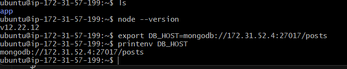

----

`cd` into `app` (twice if needed):

`npm install`

If this doesn't work, try:

`sudo apt install npm`

Database should be cleared and seeded:

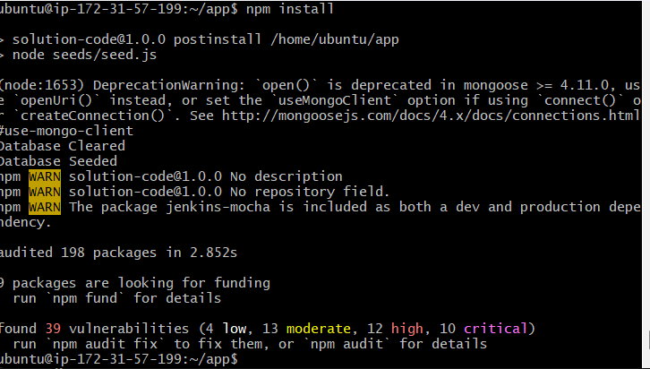

`pm2 start app.js --update-env` so the app can run in the background.

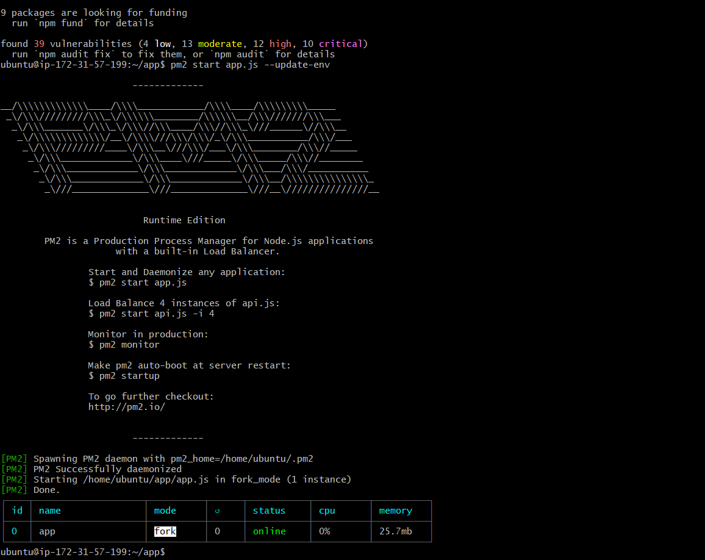

----

Go to AWS app instance:

go to public ip address and see if it works.  And with `/posts`

----

Go to your instance and under `Actions` go to `Image and templates` then `Create image`.

Enter name, using the naming convention and a description.  Then `Create image`.  This will create an AMI.

----

### 7. Automating reverse proxy

Make sure your db instance is up-to-date and connected.

Set up an app instance, using a community version of Ubuntu.

Connect to Bash using ssh key

Now you are in the instance.

`ls`

should be empty

create a file:

`touch provisionapp.sh` which will include the commands for the reverse proxy.

`sudo nano provisionapp.sh` to edit the file.

and enter the commands:

`#!/bin/bash`

`sudo apt-get update -y`

`sudo apt-get upgrade -y`

`sudo apt-get install nginx -y`

`sudo sed -i 's+try_files $uri $uri/ =404;+proxy_pass http://localhost:3000;+' /etc/nginx/sites-available/default`

`echo 'export DB_HOST=mongodb://192.168.10.150/posts' >> .bashrc` # ip address is private db address

`source .bashrc`

`sudo systemctl restart nginx`

`sudo systemctl enable nginx`

`sudo apt-get install python-software-properties -y`

`curl -sL https://deb.nodesource.com/setup_12.x | sudo -E bash -`

`sudo apt-get install nodejs -y`

`sudo npm install pm2 -g`

`sudo apt-get install git -y`

`git clone https://github.com/yjk16/aws.git`

`cd /home/ubuntu/app`

`pm2 stop all`

`npm install`

`node seeds/seed/js`

`pm2 start app.js --update-env`

Save this.

----

`ls -l` to check permissions

`chmod +x provisionapp.sh` to add execution permissions. This gives everyone permission.

`ls` and here `provisionapp.sh` should be green.

`./provisionapp.sh` to execute app and run provision file.

----

Can use `cat /var/log/cloud-init-output.log` to check log.