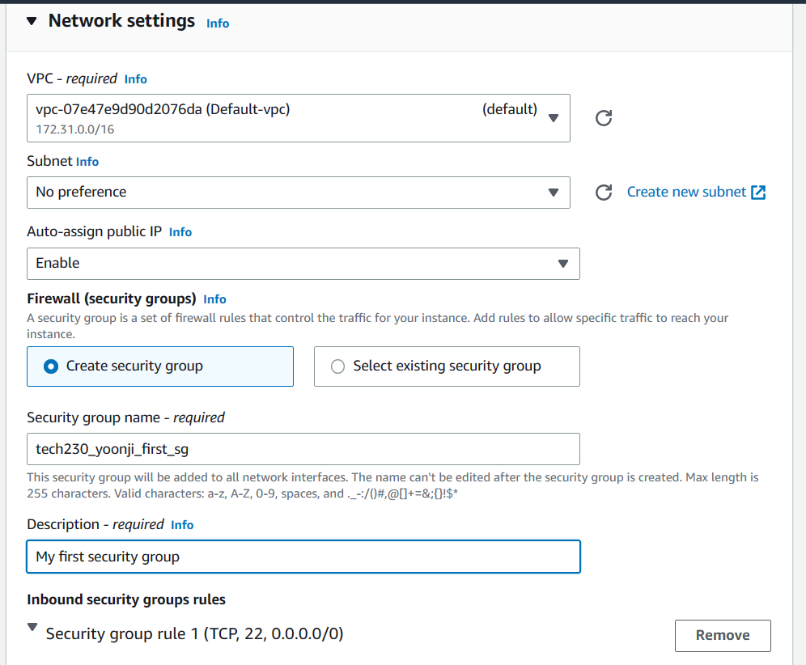

# AWS EC2

Log into the AWS console and make sure you are set to the Ireland (eu-west-1) region setting.

----

Virtual machines here are called EC2 = elastic cloud 2 = instances

Go to EC2 dashboard.

It should look like this:

----

Click on the orange `Launch instance` button and launch a new instance.

Name your instance by using the naming convention:

group - name - type of resource

In this example:

`tech230_yoonji_first_ec2`

To choose the operating system, under `Application and OS Images`:

Click `Ubuntu`

----

For the Instance type (hardware):

click `t2.micro`
It should say `Family:t2` under this.

For the Key pair (login):
tech230

----

For the Network settings:
press `edit`

Under `Firewall`:

`Create security group`

Under `Security group name` create a name remembering to use the naming convention:

For example:
`tech230_yoonji_first_sg`

Add a description = `My first security group`

Under `Inbound security group rules`

You can `Add security group rule`

Under `Type` put `HTTP`

And under `Source` put `0.0.0.0/0` which will allow anyone anywhere to access this.

----

`Launch instance`

Click `Instances` to check it's running...

Click on the instance that you want (under your name)

Then the `connect` button
Then `SSH client`

----

Open a Bash terminal:

And `cd .ssh` from home.

Then:

`chmod 400 tech230.pem`

----

Grab the code under `Example` back on the AWS webpage:

And paste this ssh key into your bash terminal:

press 'yes' when it asks about the fingerprint:

You are now in the VM.

----

`sudo apt update -y`

`sudo apt upgrade -y`

`sudo apt install nginx -y`

`sudo systemctl start nginx`

`sudo systemctl enable nginx -y`

`sudo systemctl status nginx`

----

Go back to webpage:

Copy the ip address and paste it into a web browser to check:

If you see the above, then you've been successful!

Don't forget to terminate your instance when you're done:

