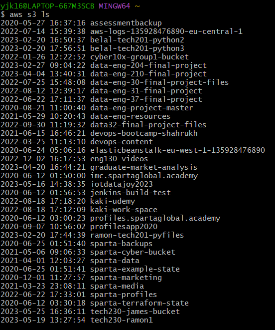

# AWS S3

### What is AWS S3

(info from docs.aws.amazon.com)

S3 stands for Simple Secure Storage.  Customers can use this service to store and protect any amount of data for a range of use cases, such as data lakes, websites, mobile applications, backup and restore, archive, enterprise applications, IoT devices and big data anayltics.

----

### How AWS S3 provides high availabiliy

High availability starts with infrastructure that is resilient and resistent to disruption.  AWS S3 delivers high durability, availability, and performant object storage.

----

To use AWS CLI and Python Boto3 first make sure you have installed the right packages.

Into a terminal enter:

`pip install awscli boto3`

### To connect via terminal:

In terminal:

`aws configure`

Make sure you're in the correct directory:

Enter your `AWS Access Key ID`

Enter your `AWS Secret Access key`

Enter `eu-west-1`

Enter `json`

Then `aws s3 ls` to see a list of s3s:

You are now connected.

`aws ec2 describe-instances` will return all the EC2 instances running on AWS in json format.

----

### To make a bucket in the terminal

`aws s3 mb s3://<tech230-yoonji-bucket> --region eu-west-1`
where <> = name of bucket

----

### To copy a bucket in the terminal

`aws s3 cp sampletext.txt s3://tech230-yoonji-bucket`
Here 'sampletext.txt' is the name of the file and 'tech230-yoonji-bucket' is the name of the bucket.

To check, go to your AWS console and click on your bucket.  Your text file should be there.

----

### To read a bucket in the terminal

`aws s3 sync s3://tech230-yoonji-bucket s3_downloads`
where 'tech230-yoonji-bucket' is the name of the bucket

----

### To delete a bucket in the terminal

You can't delete a bucket that has something in it.  You have to empty it first.

`aws s3 rm s3://tech230-yoonji-bucket/sampletext.txt` to remove it first, then

`aws s3 rb s3:// tech230-yoonji-bucket` to remove everything.

`aws s3 rm s3://tech230-yoonji-bucket --recursive` to delete everything

----

### To CRUD in Python using boto3git

### To access s3

`import boto3`

`s3 = boto3.resource("s3")`

`for bucket in s3.buckets.all():`
    `print(bucket.name)`

----

### To upload to bucket

`import boto3`

`s3 = boto3.resource("s3")`

`data = open("sampletext.txt", "rb")`

`s3.Bucket("tech230-yoonji-boto").put_object(Key="sampletext.txt", Body=data)`

----

### To download from bucket

`import boto3`

`s3 = boto3.client("s3")`

Where the arguments are ("name of bucket", "name of file being copied", "name of file once copied")
`s3.download_file("tech230-yoonji-boto", "sampletext.txt", "sampletext1.txt")`

`print(s3)`

----

### To delete from bucket

`import boto3`

`s3 = boto3.resource("s3")`

Where the arguments are ("name of bucket", "name of file"):
`s3.Object("tech230-yoonji-boto", "sampletext.txt").delete()`

----

### To set up an EC2 Ubuntu instance with AWS CLI, Python boto3

1. Make sure they have the right dependencies.  So once you've created an instance and ssh'ed in:

If you haven't already done it (via user data, for exmaple):

`sudo apt get update -y`
`sudo apt get upgrade -y`

Python comes with Ubuntu Server so it should already be installed but to check:

`python --version`

And if not:

`sudo apt install python3`

And:

`sudo apt install python3-pip`

Can check to see:

`pip --version`

`python --version` or `python3 --version`

If these are both there, install boto3:

`pip install boto3`

To check:

`pip show boto3`

Then install awscli:

`sudo apt install awscli`

----

After this, you should be able to log in using:

`aws configure` and entering Access Key ID, Secret Access Key, Default region name and default output format.

Can do:

`aws s3 ls` to check.  Should list the s3 buckets:

Then create a bucket:

`aws s3 mb s3://tech230-yj-bucket --region eu-west-1`

And upload to that bucket:

`aws s3 cp sampletext.txt s3://tech230-yj-bucket`

If you go to AWS S3 - Buckets, then search for yours, your file should be there:

Then to to upload data and retrieve content and then delete it:

If you check on your AWS console, it should be gone!

