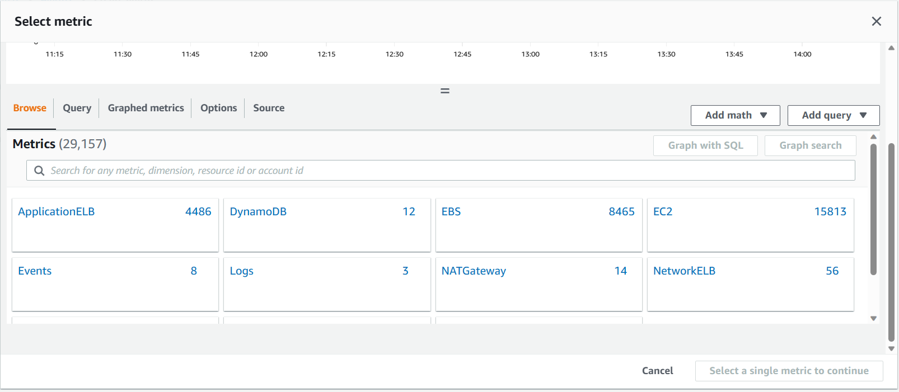

# Cloudwatch

### 1. What is it?

(info from docs.aws.amazon.com)

Cloudwatch is a service provided by AWS which monitors your resources and applications. You can `manage detailed monitoring` which costs a bit more but gives you metrics per minute. You can also create a dashboard to display a customised collections of metrics.

### 2. Why is this useful?

You can use monitoring so that when something happens to a metric that you are monitoring, an alarm will be triggered.  For example you could set up an alarm for the CPU usage for an instance so that when it goes above that, you receive an email notification.

### 3. How to set up a dashboard to see stats on Cloudwatch

1. Set up an instance

- can use previous version or create a new one
- If using the Sparta app without db, can comment out those parts
- Launch the instance and check it gets to the Sparta app page

2. Making a dashboard

- Go to your instance summary
- go to the `monitoring` tab.  Nothing will be happening straight away.
- Click `Manage detailed monitoring` for per minute monitoring.
- Under `Manage detailed monitoring`, click `Add to dashboard`
- Can either select a previously made one or create a new one.  Remember to use the naming convention. E.g. `tech230-yj-test-dashboard`
- `Create new` then `Add to dashboard`. Here you can see all the stats.

NOTE: It is possible to collect statistics from Cloudwatch and feed this into other software

### 4. How to create an alarm based on CPU usage

1. In your AWS console, navigate to the `Cloudwatch` page, then under `Alarms` in the menu on the left, pick `All alarms`

2. Click on `Create alarm`

4. Click on `Select metric`

5. Under `Metrics` click on `EC2`

6. Click on `Per-Instance Metrics` then search for your instance by entering the `Instance ID` into the search bar. (You can find this on your instance summary page.) Find the one with `metric name` `CPUUtilization` and click this and then `Select metric`

7. On the `Specify metric and conditions` page you can leave the `Metric` section as it is.  Under `Conditions`:
- For `Threshold type` click on `Static`
- Pick the threshold alarm condition and threshold value.
- Under `Additional configuration` `Datapoints to alarm` defines the when the alarm is evaluated.  The first number is the `period` and the second number the `evaluation period`.  If the `period` was 5 minutes and the `evaluation period` was 1, then at the end of 5 minutes, the alarm would evaluate based on data from minutes 1 to 5.  At the end of 6 minutes, it would evaluate based on data from minutes 2 to 6.
- `Missing data treatment`
    - notBreaching - Missing data points are treated as 'good' and within the threshold
    - breaching - Missing data points are treated as 'bad' and breaching the threshold
    - ignore - The current alarm state is maintained
    - missing - If all data is missing, the alarm transitions to INSUFFICIENT_DATA

- `Metric Alarm States`
    - OK - Metric is within defined threshold
    - ALARM - Metric is outside of defined threshold
    - INSUFFICIENT_DATA - Metric is not available or not enough data is available

8. On the `Configure actions` page, under `Notification`, click `In alarm`
- Under `Send a notification to the following SNS topic`, `Create new topic` and fill out information.

`Create topic`

`Next`

9. Add name and description for your alarm

10. Preview the details for your alarm, and if happy, `Create alarm`

11. Once your alarm is triggered, you will receive an email:

