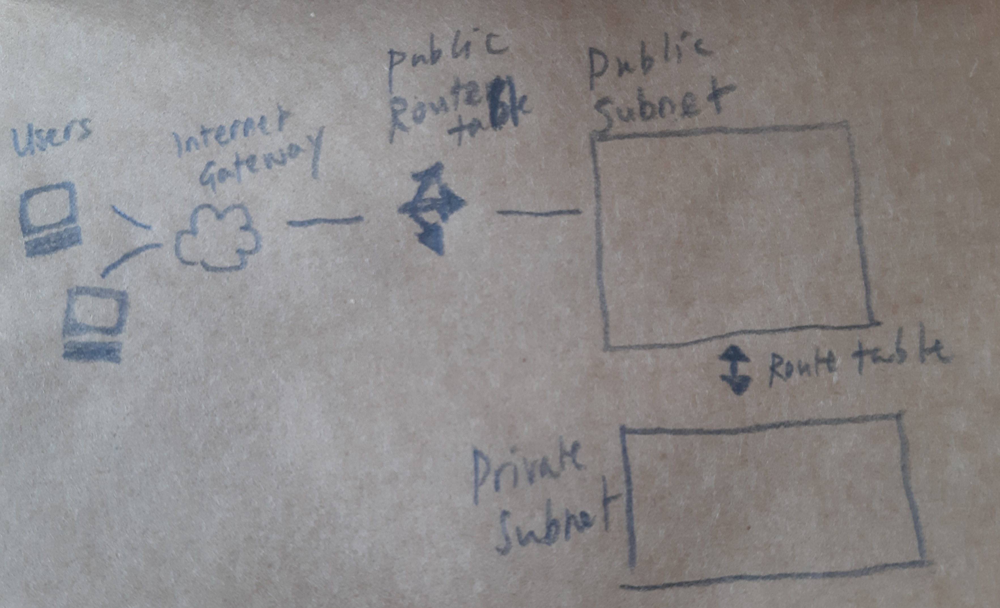

# VPC

### What is it?

A VPC (Virtual Private Cloud) is a private cloud hosted within a public cloud.

Imagine you are about to attend a performance at a multi-stage venue.

You would enter through the doorway (Internet Gateway), before being directed at the box office (Public Route Table) in which direction to go to, to find the correct space to watch your performance.

When you get to the desired room (Public Subnet), you can watch the performance on stage (Website/ App) without a second thought to all the organising and work that happens backstage (Private Subnet) in order for all the things you're seeing to run as smoothly as possible.

----

## Steps to create a VPC with 2 tier architecture (i.e. a public subnet and a private subnet)

### 1. Create VPC

Go to AWS console and search for `VPC`, then on the page, `Create VPC`

Pick `VPC only`

Name tag `tech230-yoonji-nginx-vpc`

Under `IPv4 CIDR`, put `10.0.0.0/16`

----

### 2. Internet Gateway

Find `Internet gateways` on the left and `Create internet gateway`.

Put in name using the naming convention, for example `tech230-yoonji-nginx-IGW`, where IGW = internet gateway.

In green is the success message.  You can `Attach to a VPC` from here.

----

### 3. Connect the internet gateway to the VPC

Enter your name to search for and attach to the created VPC with your name.

<!--  -->

And `Attach Internet gateway`

----

### 4. Create subnets

CLick `Subnet` on the left and then click `Create subnet`

You have to select a VPC. Can search your name again to find the one you want.

Fill in the subnet settings:

You will want to `Add a new subnet` after this, to add your private subnet.  Be sure to label this correctly so you can tell the difference.

If you want to spread the availability zones, can pick eu-west-1b for the private subnet.

For the CIDR block, you will need to put a different number, so `10.0.3.0/24`

Then `Create subnet` which should lead you to:

NOTE: The above photo only shows the public subnet.

You can add more subnets here if needed.

----

### 5. Route tables

Go to `Route tables` in the dropdown contents on left. Then `Create route table`.

Fill out details:

And `Create route table`.

----

Under `subnet associations`

Under `explicit subnet associations`, `edit subnet associations`

Find yours by searching your name:

 and click the box next to it.

NOTE: only associate the public subnet for public route table!

`Save associations`:

Should look like:

NOTE: the above only shows the public subnet.  The private subnet would be listed under `Subnets without explicit associations`.

----

### 7. Linking the internet gateway to public route table

Go to `Routes` in `Route tables` then `Edit routes` and `Add route`

Choose under `Destination` `0.0.0.0/0` and under Target `Internet Gateway` and your internet gateway should come up. Select this.

`Save changes`

----

### 8. Create Nginx App and Mongodb VMs

The last step is to create the VMs.

Go to instances.  Create a new instance.

Use a suitable name, like `tech230-yoonji-nginx-vpc`and select a suitable AMI under community AMIs.  Or here, if you have an AMI that you are sure works (with added bindip changes in the mongodb AMI and the environment changes in the nginx AMI in this example) you can select the approprite AMIs under `My AMIs`.

You will want to have the Mongodb one running first.

Fill out all the usual data.

Make sure to `Edit Network settings`

And for the `VPC`, search for your name and select this one.

Make sure under `Subnet` you pick the private subnet here.

You won't be able to select an exisiting security group so will need to `Create security group`.

Make sure to add a `security group rule` for port 27017.

When you are happy with all the details, you can start the instance.

----

For the nginx app instance, you can follow the same steps.

Under `Edit network settings` remember to select the appropriate `VPC`.

Make sure under `Subnet` you pick the public subnet here.

Under `Auto-assign public IP`, click `Enable`.

`Add security group rule` for `HTTP` for `anywhere` and for port `3000` for `anywhere` (although if reverse proxy is working, this shouldn't be needed.)

Usually for SSH, you would change `Source type` to `My IP` for better security.

Then add the user data to enable nginx.
