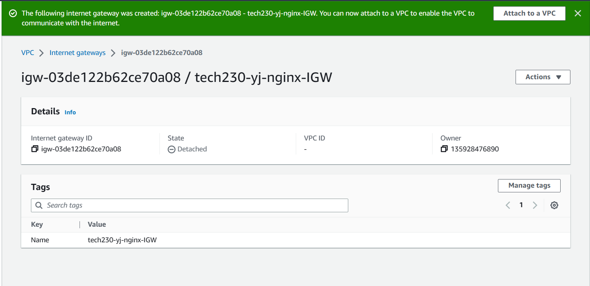

## Steps to create a VPC with a public subnet

### 1. Create VPC

Go to AWS console and search for `VPC`, then on the page, `Create VPC`

Pick `VPC only`

Name tag `tech230-yoonji-nginx-vpc`

Under `IPv4 CIDR`, put `10.0.0.0/16`

----

### 2. Internet Gateway

Find `Internet gateways` on the left and `Create internet gateway`.

Put in name using the naming convention, for example `tech230-yoonji-nginx-IGW`, where IGW = internet gateway.

In green is the success message.  You can `Attach to a VPC` from here.

----

### 3. Connect the internet gateway to the VPC

Enter your name to search for and attach to the created VPC with your name.

<!--  -->

And `Attach Internet gateway`

----

### 4. Public subnet

CLick `Subnet` on the left and then click `Create subnet`

You have to select VPC. Can search your name again to find the one you want.

Fill in the subnet settings:

`Create subnet` which should lead you to:

Can add more subnets here if needed.

----

### 5. Route tables

Go to `Route tables` in the dropdown contents on left. Then `Create route table`.

Fill out details:

And `Create route table`.

----

Under `subnet associations`

Under `explicit subnet associations`, `edit subnet associations`

Find yours by searching your name:

 and click the box next to it.

NOTE: only associate public subnet for public route table.

`Save associations`:

Should look like:

----

### 7. Linking the internet gateway to public route table

Go to `Routes` in `Route tables` then `Edit routes` and `Add route`

Choose under `Destination` `0.0.0.0/0` and under Target `Internet Gateway` and your internet gateway should come up. Select this.

`Save changes`

----

### 8. Create Nginx VM

The last step is to create the app vm.

Go to instances.  Create a new instance.

Use a suitable name, like `tech230-yoonji-nginx-vpc`and select a suitable AMI under community AMIs.

Fill out all the usual data.

`Edit Network settings`

For the `VPC`, search for your name and select this one.

Under `Auto-assign public IP`, click `Enable`.

You won't be able to select an exisiting security group so will need to `Create security group`.

`Add security group rule` for `HTTP` for `anywhere` and for port `3000` for `anywhere` (although if reverse proxy is working, this shouldn't be needed.)

Usually for SSH, you would change `Source type` to `My IP` for better security.

Then add the user data to enable nginx.